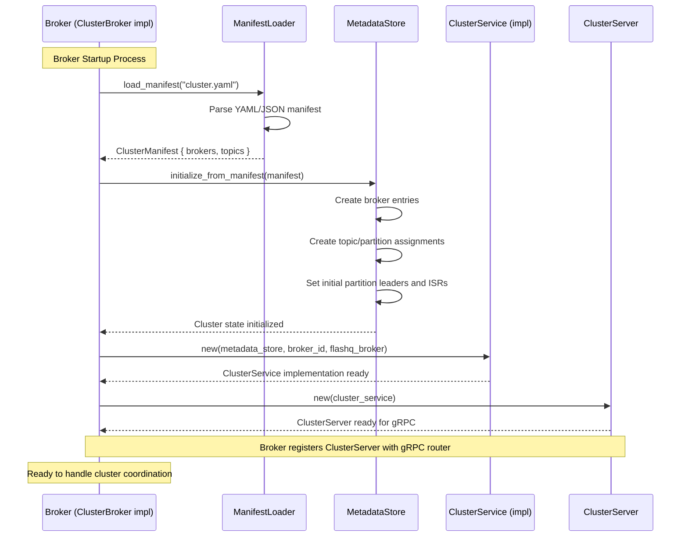
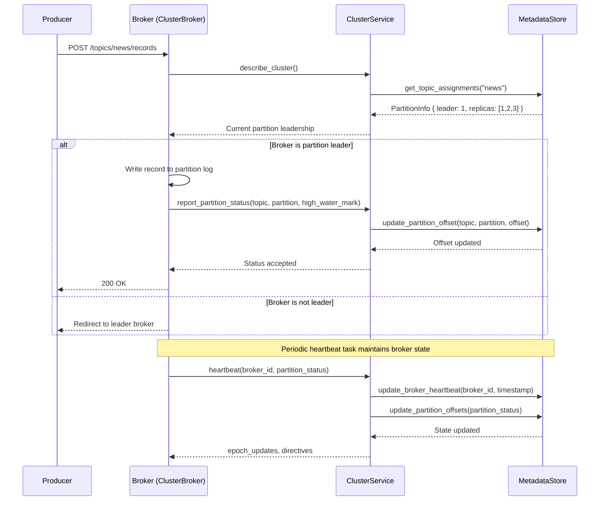
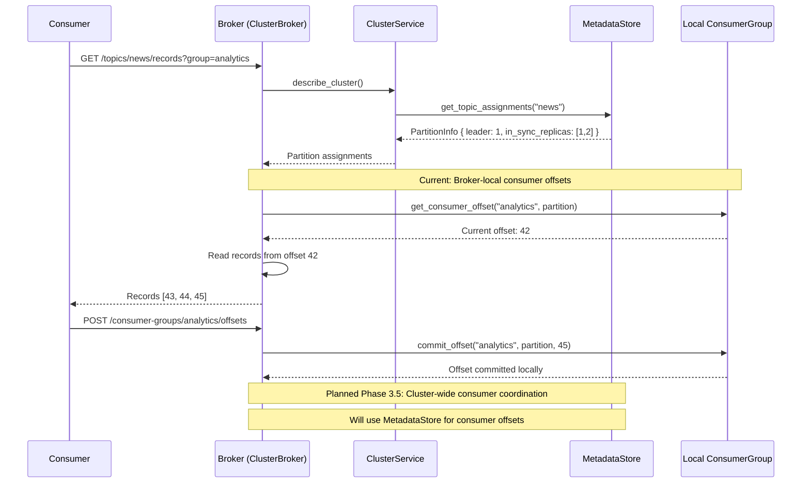
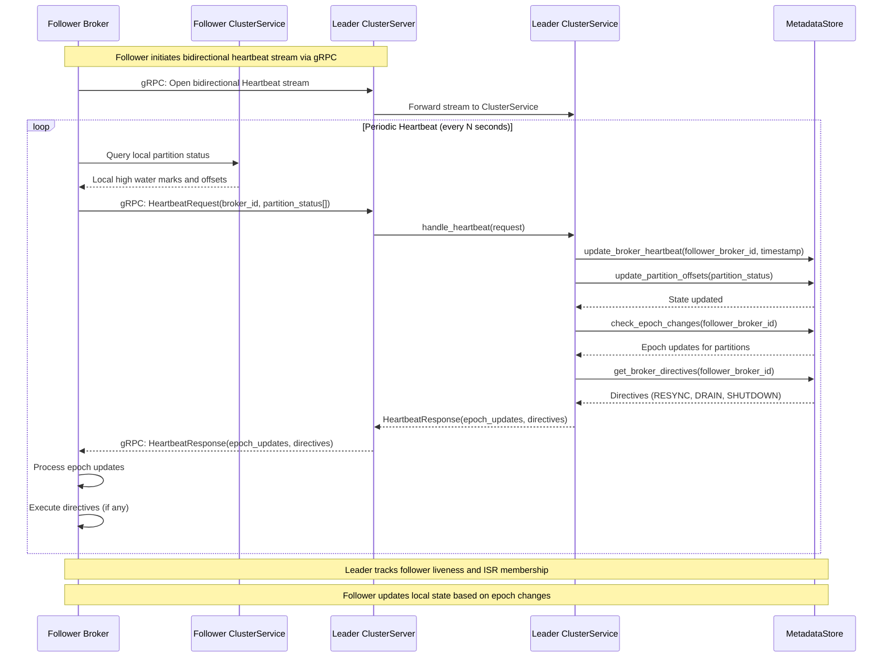

# FlashQ Cluster

A distributed cluster coordination system for FlashQ message queues, providing metadata management, broker coordination, and partition leadership protocols.

## Overview

The `flashq-cluster` crate implements the cluster coordination layer for FlashQ, enabling:

- **Cluster Metadata Management**: Track brokers, topics, and partition assignments
- **Leader Election**: Coordinate partition leadership across brokers
- **Heartbeat Protocol**: Monitor broker health and propagate cluster state updates
- **Manifest-based Bootstrap**: Initialize cluster state from configuration files

## Architecture

The cluster coordination system consists of several key components:

- **MetadataStore**: Persistent storage for cluster state (in-memory and file-based backends)
- **ClusterService trait**: Interface for cluster coordination protocol operations (describe, heartbeat, status reporting)
- **ClusterServiceImpl**: Concrete implementation of ClusterService that integrates with brokers
- **ClusterBroker trait**: Interface for broker implementations to provide runtime state (offsets, leadership)
- **ClusterServer**: gRPC server adapter wrapping ClusterService implementation for network communication
- **ClusterClient**: gRPC client for broker-to-broker or broker-to-controller communication
- **ManifestLoader**: Bootstrap cluster state from manifest files

## Cluster Coordination Scenarios

### 1. Startup: Manifest-Based Initialization

During broker startup, the cluster state is initialized from a manifest file that defines the desired cluster topology.



**Key Steps:**
1. **Manifest Loading**: Parse YAML/JSON manifest defining brokers and topic assignments
2. **State Initialization**: Populate MetadataStore with broker specs and partition assignments
3. **Service Initialization**: Create ClusterService implementation (ClusterServiceImpl) with MetadataStore and ClusterBroker
4. **gRPC Server Setup**: Wrap ClusterService in ClusterServer for network communication
5. **Readiness**: Broker is ready to participate in cluster coordination

### 2. Message Production: Partition Leadership Coordination

When a message is added to a topic, brokers coordinate through the local ClusterService to verify leadership and report partition state.



**Key Steps:**
1. **Leadership Discovery**: Query local ClusterService for current partition leader
2. **Record Handling**: Leader broker writes to partition log via ClusterBroker interface
3. **Status Reporting**: Broker reports high water mark through local ClusterService
4. **Heartbeat Maintenance**: Periodic heartbeat updates broker liveness and partition state in MetadataStore

### 3. Message Consumption: Offset Coordination

When a message is read from a topic, consumer group offsets are coordinated through the broker's local storage (current implementation) or cluster metadata (planned Phase 3.5).



**Key Steps:**
1. **Partition Discovery**: Query local ClusterService for partition assignments and leadership
2. **Offset Retrieval**: Get current consumer group offset (currently from broker-local storage)
3. **Record Delivery**: Serve records starting from the consumer's last committed offset
4. **Offset Commit**: Update consumer group progress (currently stored locally per broker)

**Future (Phase 3.5)**: Consumer group coordination will move to MetadataStore for cluster-wide consistency, enabling proper partition rebalancing and failure recovery across brokers.

### 4. Follower Replication: Leader-Follower Synchronization

Follower brokers maintain bidirectional heartbeat connections with the leader to stay in sync with partition state and receive replication directives.



**Key Steps:**
1. **Stream Initialization**: Follower opens bidirectional heartbeat stream with leader's ClusterServer via gRPC
2. **Status Collection**: Follower queries its local ClusterService for partition state (high water marks, offsets)
3. **Heartbeat Send**: Follower sends HeartbeatRequest via gRPC to leader's ClusterServer
4. **RPC Forwarding**: ClusterServer forwards request to its ClusterService implementation
5. **Leader Processing**: ClusterService updates broker liveness and partition offsets in MetadataStore
6. **Epoch Check**: Leader checks for any partition epoch changes the follower needs to know about
7. **Directive Generation**: Leader determines if follower needs special directives (RESYNC, DRAIN, SHUTDOWN)
8. **Response Delivery**: ClusterServer sends HeartbeatResponse back via gRPC
9. **Follower Sync**: Follower applies epoch updates and executes directives to stay in sync

**Replication Semantics:**
- **In-Sync Replica (ISR) Tracking**: Leader tracks which followers are keeping up based on heartbeat frequency and offset lag
- **Epoch-Based Consistency**: Epoch numbers prevent split-brain scenarios during leadership changes
- **Directive-Based Control**: Leader can instruct followers to RESYNC (catch up), DRAIN (prepare for shutdown), or SHUTDOWN (graceful termination)

## Cluster Protocol Messages

### DescribeCluster
Returns current cluster topology including broker health and topic assignments.

```protobuf
message DescribeClusterResponse {
  repeated BrokerInfo brokers = 1;
  repeated TopicAssignment topics = 2;
  uint32 controller_id = 3;
}
```

### Heartbeat (Bidirectional Streaming)
Maintains broker liveness and propagates partition state updates.

```protobuf
message HeartbeatRequest {
  uint32 broker_id = 1;
  repeated PartitionHeartbeat partitions = 2;
  string timestamp = 3;
}

message HeartbeatResponse {
  repeated PartitionEpochUpdate epoch_updates = 1;
  repeated BrokerDirective directives = 2;
  string timestamp = 3;
}
```

### ReportPartitionStatus
Notifies controller of partition state changes (leadership, ISR updates, offsets).

```protobuf
message ReportPartitionStatusRequest {
  string topic = 1;
  uint32 partition = 2;
  uint32 leader = 3;
  repeated uint32 in_sync_replicas = 5;
  uint64 high_water_mark = 6;
  string timestamp = 8;
}
```

## MetadataStore Backends

### In-Memory Store
- **Use Case**: Development, testing, single-broker deployments
- **Features**: Fast access, no persistence
- **Limitations**: State lost on restart

### File-Based Store
- **Use Case**: Production deployments requiring persistence
- **Features**: JSON persistence, directory locking, crash recovery
- **Storage**: Cluster state persisted to `metadata.json`

## Error Handling

The cluster coordination system provides comprehensive error handling:

- **Stale Epoch Rejection**: Prevents outdated leadership claims
- **Heartbeat Timeout**: Automatic broker failure detection
- **Split-Brain Prevention**: Epoch-based consistency guarantees
- **Network Partition Tolerance**: Graceful degradation during connectivity issues

## Integration

The cluster service integrates with FlashQ brokers through multiple layers:

### Broker-Side Integration

1. **ClusterBroker Trait Implementation**: Brokers implement the `ClusterBroker` trait to expose runtime state (offsets, high water marks) to the cluster coordination layer
2. **ClusterService Initialization**: Create a `ClusterService` implementation (ClusterServiceImpl) with shared `MetadataStore`, broker ID, and `ClusterBroker` implementation
3. **ClusterServer Registration**: Wrap the `ClusterService` in `ClusterServer` and register with the broker's gRPC router
4. **Local Access**: Broker holds reference to `ClusterService` for direct local calls (describe_cluster, report_partition_status)
5. **Network Communication**: Remote brokers communicate via gRPC through the `ClusterServer` endpoint

### Inter-Broker Communication

1. **ClusterClient**: Brokers use `ClusterClient` for communicating with other brokers or dedicated controller nodes
2. **gRPC Protocol**: All cluster coordination uses the gRPC protocol defined in `cluster.proto`
3. **Streaming RPCs**: Heartbeat uses bidirectional streaming for efficient real-time state synchronization

### Data Flow

- **Metadata Store**: Shared instance between broker runtime and `ClusterService` implementation ensures consistency
- **ClusterBroker Interface**: ClusterService queries broker runtime state through trait methods without tight coupling
- **Local Calls**: Broker makes direct calls to its local `ClusterService` for coordination operations
- **Network Calls**: Remote brokers communicate via gRPC through `ClusterServer` which delegates to `ClusterService`
- **Partition Status**: Broker reports partition state via `report_partition_status` and heartbeat messages
- **Epoch Updates**: ClusterService returns epoch changes and directives through heartbeat responses

## Testing

Comprehensive test coverage includes:

- **Unit Tests**: MetadataStore operations, manifest loading, service logic
- **Integration Tests**: End-to-end cluster coordination scenarios
- **Error Simulation**: Network failures, epoch conflicts, timeout handling
- **Persistence Tests**: File-based store recovery and consistency

## Example Manifest

```yaml
brokers:
  - id: 1
    host: "broker-1.cluster.local"
    port: 9092
  - id: 2
    host: "broker-2.cluster.local"
    port: 9092
  - id: 3
    host: "broker-3.cluster.local"
    port: 9092

topics:
  news:
    partitions:
      - partition: 0
        leader: 1
        replicas: [1, 2, 3]
        in_sync_replicas: [1, 2]
      - partition: 1
        leader: 2
        replicas: [2, 3, 1]
        in_sync_replicas: [2, 3]

  analytics:
    partitions:
      - partition: 0
        leader: 3
        replicas: [3, 1, 2]
        in_sync_replicas: [3, 1, 2]
```

This cluster coordination system ensures reliable message delivery, consistent partition leadership, and robust failure handling across the FlashQ distributed message queue.