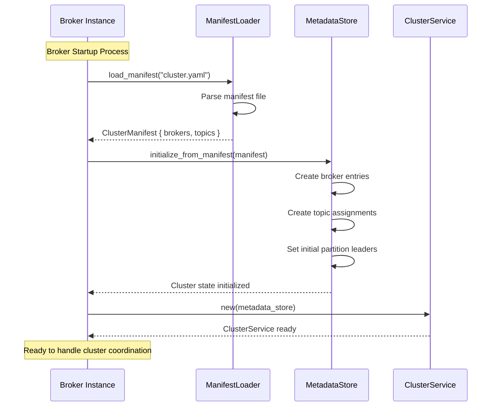
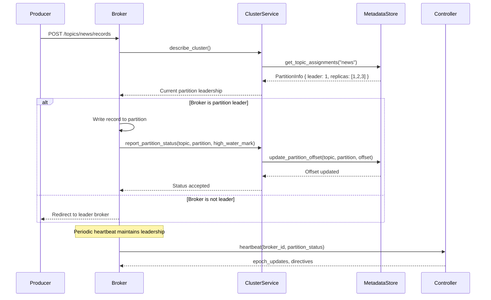
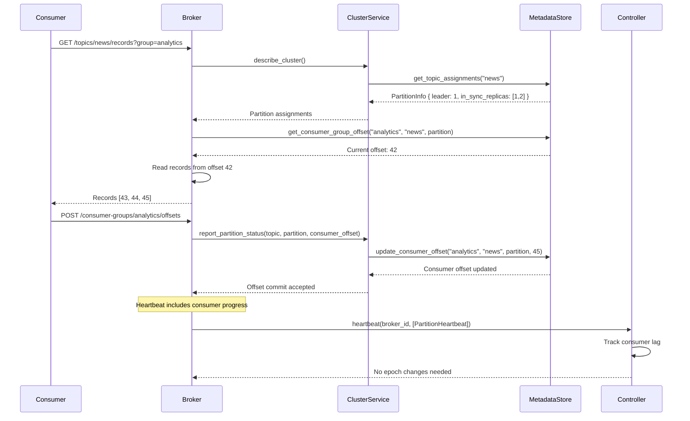

# FlashQ Cluster

A distributed cluster coordination system for FlashQ message queues, providing metadata management, broker coordination, and partition leadership protocols.

## Overview

The `flashq-cluster` crate implements the cluster coordination layer for FlashQ, enabling:

- **Cluster Metadata Management**: Track brokers, topics, and partition assignments
- **Leader Election**: Coordinate partition leadership across brokers
- **Heartbeat Protocol**: Monitor broker health and propagate cluster state updates
- **Manifest-based Bootstrap**: Initialize cluster state from configuration files

## Architecture

The cluster coordination system consists of several key components:

- **MetadataStore**: Persistent storage for cluster state (in-memory and file-based backends)
- **ClusterService**: gRPC service implementing the cluster coordination protocol
- **ManifestLoader**: Bootstrap cluster state from manifest files
- **Client/Server**: gRPC adapters for broker-to-controller communication

## Cluster Coordination Scenarios

### 1. Startup: Manifest-Based Initialization

During broker startup, the cluster state is initialized from a manifest file that defines the desired cluster topology.



**Key Steps:**
1. **Manifest Loading**: Parse YAML/JSON manifest defining brokers and topic assignments
2. **State Initialization**: Populate MetadataStore with broker specs and partition assignments
3. **Service Bootstrap**: Start ClusterService with initialized metadata store
4. **Readiness**: Broker is ready to participate in cluster coordination

### 2. Message Production: Partition Leadership Coordination

When a message is added to a topic, the cluster service coordinates partition leadership and replication.



**Key Steps:**
1. **Leadership Check**: Verify current partition leader through cluster metadata
2. **Record Handling**: Leader broker processes the write operation
3. **Status Reporting**: Update partition high water mark and offset tracking
4. **Heartbeat Maintenance**: Continuous leadership validation through heartbeats

### 3. Message Consumption: Offset Coordination

When a message is read from a topic, the cluster service coordinates consumer group offsets and partition assignments.



**Key Steps:**
1. **Partition Discovery**: Find which partitions to read from based on cluster metadata
2. **Offset Retrieval**: Get current consumer group offset for the partition
3. **Record Delivery**: Serve records starting from the consumer's last offset
4. **Offset Commit**: Update consumer group progress in cluster metadata
5. **Progress Tracking**: Include consumer progress in heartbeat messages

## Cluster Protocol Messages

### DescribeCluster
Returns current cluster topology including broker health and topic assignments.

```protobuf
message DescribeClusterResponse {
  repeated BrokerInfo brokers = 1;
  repeated TopicAssignment topics = 2;
  uint32 controller_id = 3;
}
```

### Heartbeat (Bidirectional Streaming)
Maintains broker liveness and propagates partition state updates.

```protobuf
message HeartbeatRequest {
  uint32 broker_id = 1;
  repeated PartitionHeartbeat partitions = 2;
  string timestamp = 3;
}

message HeartbeatResponse {
  repeated PartitionEpochUpdate epoch_updates = 1;
  repeated BrokerDirective directives = 2;
  string timestamp = 3;
}
```

### ReportPartitionStatus
Notifies controller of partition state changes (leadership, ISR updates, offsets).

```protobuf
message ReportPartitionStatusRequest {
  string topic = 1;
  uint32 partition = 2;
  uint32 leader = 3;
  repeated uint32 in_sync_replicas = 5;
  uint64 high_water_mark = 6;
  string timestamp = 8;
}
```

## MetadataStore Backends

### In-Memory Store
- **Use Case**: Development, testing, single-broker deployments
- **Features**: Fast access, no persistence
- **Limitations**: State lost on restart

### File-Based Store
- **Use Case**: Production deployments requiring persistence
- **Features**: JSON persistence, directory locking, crash recovery
- **Storage**: Cluster state persisted to `metadata.json`

## Error Handling

The cluster coordination system provides comprehensive error handling:

- **Stale Epoch Rejection**: Prevents outdated leadership claims
- **Heartbeat Timeout**: Automatic broker failure detection
- **Split-Brain Prevention**: Epoch-based consistency guarantees
- **Network Partition Tolerance**: Graceful degradation during connectivity issues

## Integration

The cluster service integrates with FlashQ brokers through:

1. **gRPC Service Registration**: `ClusterServer` added to broker's gRPC router
2. **MetadataStore Sharing**: Same store instance used by both broker and cluster service
3. **Client Integration**: Brokers use `ClusterClient` for controller communication
4. **Configuration**: Cluster endpoints and intervals configured through broker config

## Testing

Comprehensive test coverage includes:

- **Unit Tests**: MetadataStore operations, manifest loading, service logic
- **Integration Tests**: End-to-end cluster coordination scenarios
- **Error Simulation**: Network failures, epoch conflicts, timeout handling
- **Persistence Tests**: File-based store recovery and consistency

## Example Manifest

```yaml
brokers:
  - id: 1
    host: "broker-1.cluster.local"
    port: 9092
  - id: 2
    host: "broker-2.cluster.local"
    port: 9092
  - id: 3
    host: "broker-3.cluster.local"
    port: 9092

topics:
  news:
    partitions:
      - partition: 0
        leader: 1
        replicas: [1, 2, 3]
        in_sync_replicas: [1, 2]
      - partition: 1
        leader: 2
        replicas: [2, 3, 1]
        in_sync_replicas: [2, 3]

  analytics:
    partitions:
      - partition: 0
        leader: 3
        replicas: [3, 1, 2]
        in_sync_replicas: [3, 1, 2]
```

This cluster coordination system ensures reliable message delivery, consistent partition leadership, and robust failure handling across the FlashQ distributed message queue.