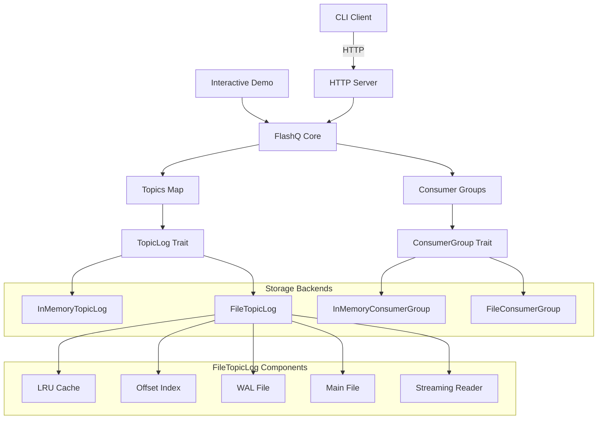
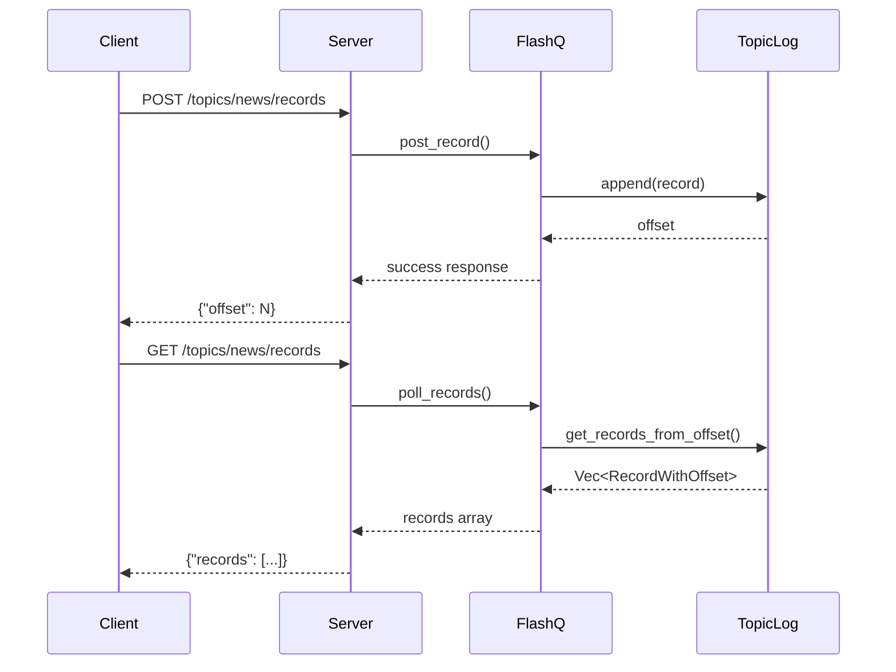
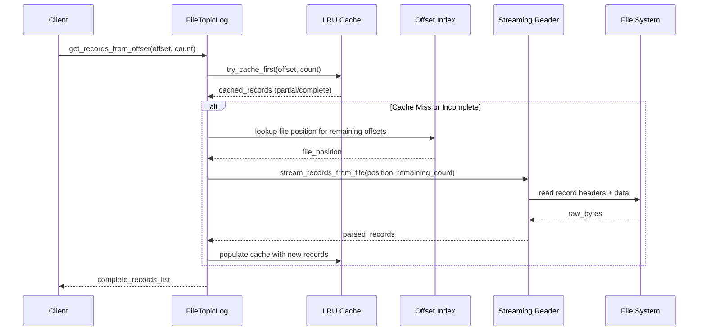

# Architecture

Internal architecture and design overview of FlashQ.

## System Overview



## Project Structure

**Core Components:**
- `FlashQ`: Topic-based record storage with pluggable backend support
- `Record/RecordWithOffset`: Record structures for requests/responses
- `TopicLog` trait: Storage abstraction for append-only topic logs
- `ConsumerGroup` trait: Storage abstraction for offset management
- `StorageBackend`: Factory with directory locking and backend selection
- `FileTopicLog`: File-based storage with write-ahead logging, crash recovery, LRU caching, and streaming reads
- `InMemoryTopicLog`: Fast in-memory storage implementation
- Error handling: Comprehensive error types with structured logging
- HTTP server: REST API with validation and consumer groups
- CLI client: Structured command interface
- Interactive demo: Educational exploration tool

**Key Features:**
- Thread-safe concurrent access (`Arc<Mutex<>>`)
- Trait-based storage abstraction for pluggable backends
- File storage with write-ahead logging and configurable sync modes
- Directory locking prevents concurrent access to file storage
- Crash recovery from persisted write-ahead logs
- Comprehensive error handling with structured logging
- Memory-efficient file operations with LRU caching and streaming reads
- Offset indexing for optimized file seeks and reduced memory usage
- Owned data returns for improved performance and safety
- OpenAPI-compliant validation and error handling
- Comprehensive integration test coverage for HTTP and storage layers

## Data Flow



## Memory-Optimized Read Flow



**Key Principles:**
- Sequential offsets with ISO 8601 timestamps
- Append-only logs ensure FIFO ordering  
- Non-destructive polling (records persist)
- Thread-safe with `Arc<Mutex<>>`
- Write-ahead logging for durability and crash recovery

## Write-Ahead Log (WAL)

**File Storage Architecture:**
- **WAL Structure**: Records written sequentially with length prefixes for recovery
- **Commit Thresholds**: Configurable batching (default: 10 records) before sync
- **Sync Modes**: `Always`, `Periodic`, `Never` for different durability guarantees  
- **Crash Recovery**: Rebuilds state from WAL during startup, handles partial writes
- **Directory Locking**: Process-level locks prevent concurrent access to storage directory

**WAL Format:**
```
[4-byte length][8-byte offset][serialized record][4-byte length][8-byte offset][serialized record]...
```

## Memory Optimizations

**LRU Cache:**
- Configurable cache size (default: 1000 records) with automatic eviction
- Cache-first reads for recent records with O(1) access time
- Transparent fallback to disk streaming for cache misses
- Cache population on writes for improved subsequent read performance

**Offset Index:**
- BTreeMap index maps offsets to file positions for O(log n) seeks
- Reduces file scanning for random offset access patterns
- Built incrementally during writes and recovery operations

**Streaming Reads:**
- Memory-bounded file reading without loading entire files into memory
- Record-by-record processing with fixed-size buffers
- Handles both main file and WAL file sources transparently
- Early termination when requested record count is satisfied

## Design Decisions

**Architecture Choices:**
- **Storage abstraction**: Trait-based pluggable backends with memory and file implementations
- **Write-ahead logging**: Durability with configurable performance trade-offs
- **Directory locking**: Prevents data corruption from concurrent processes
- **Error handling**: Comprehensive error types with context preservation
- **Owned data**: Returns `Vec<RecordWithOffset>` vs references
- **Safe casting**: `try_into()` with bounds checking
- **Append-only logs**: Immutable history, FIFO ordering

## Performance Characteristics

**Complexity:**
- Memory storage: O(n) total records
- File storage: O(1) append, O(k) for k records read with LRU cache benefits
- Post: O(1) append operation (with optional WAL sync and cache population)
- Poll: O(1) cache hit or O(k) streaming read for k records
- Offset seeks: O(log n) with BTreeMap index, O(1) cache hit
- Concurrency: Single lock bottleneck per storage backend

**Trade-offs:**
- **Memory vs File**: Speed vs persistence
- **WAL sync modes**: Durability vs performance
- **Cache size**: Memory usage vs read performance
- **Streaming reads**: Memory efficiency vs batch read speed
- **Directory locking**: Safety vs multi-process access
- **Commit thresholds**: Write batching vs durability
- FIFO ordering vs parallelism

## Storage Backend Comparison

| Feature | Memory | File |
|---------|--------|------|
| **Speed** | Fastest | Fast with WAL batching and LRU cache |
| **Persistence** | None | Full durability |
| **Recovery** | No | Crash recovery from WAL |
| **Concurrency** | Multi-thread only | Multi-process safe |
| **Resource Usage** | RAM only | Disk + configurable LRU cache |
| **Memory Efficiency** | High RAM usage | Bounded memory with streaming reads |