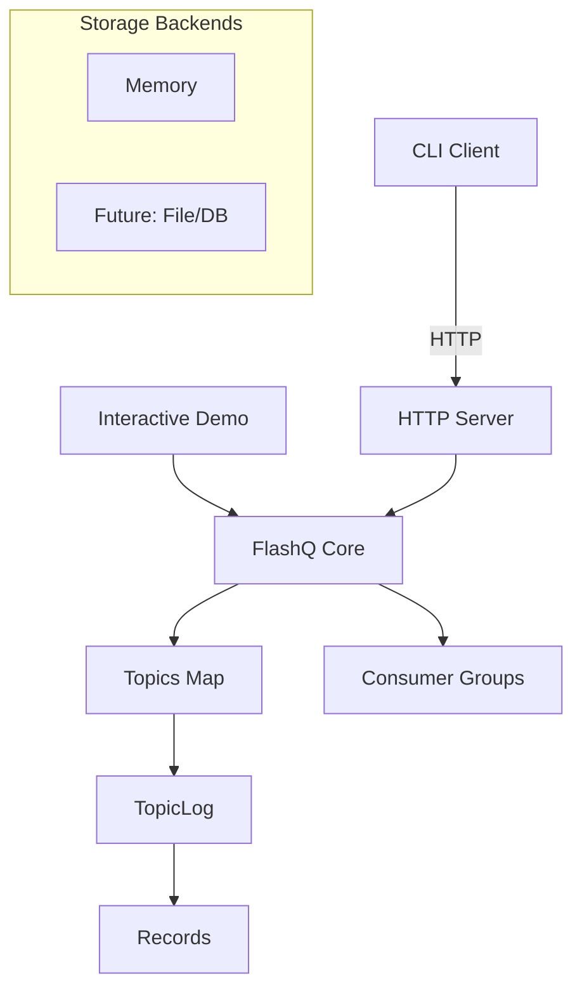
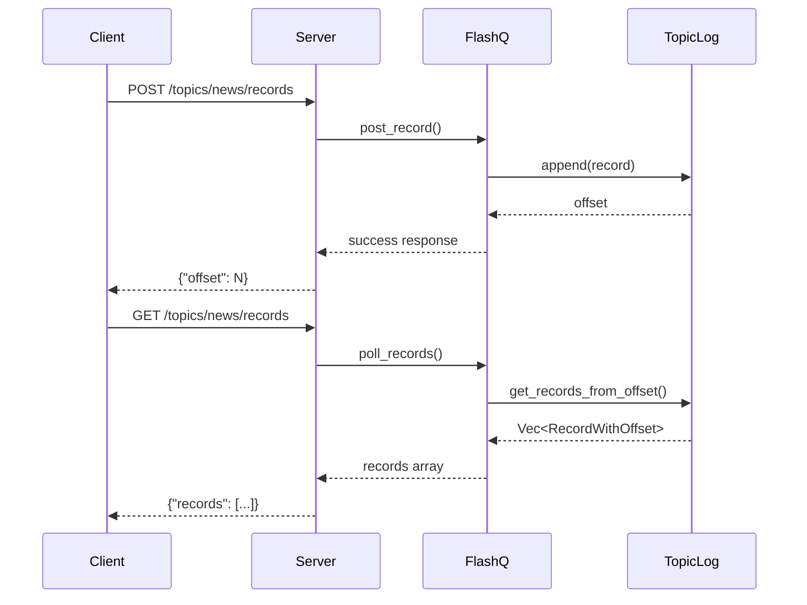

# Architecture

Internal architecture and design overview of FlashQ.

## System Overview

## Project Structure

**Core Components:**
- `FlashQ`: Topic-based record storage with offset tracking
- `Record/RecordWithOffset`: Record structures for requests/responses
- `TopicLog` trait: Storage abstraction for different backend implementations
- `StorageBackend`: Factory for creating storage instances 
- `InMemoryTopicLog`: Default in-memory storage implementation
- HTTP server: REST API with validation and consumer groups
- CLI client: Structured command interface
- Interactive demo: Educational exploration tool

**Key Features:**
- Thread-safe concurrent access (`Arc<Mutex<>>`)
- Trait-based storage abstraction for pluggable backends
- Owned data returns for improved performance and safety
- OpenAPI-compliant validation and error handling
- Comprehensive integration test coverage

## Data Flow

**Key Principles:**
- Sequential offsets with ISO 8601 timestamps
- Append-only logs ensure FIFO ordering  
- Non-destructive polling (records persist)
- Thread-safe with `Arc<Mutex<>>`

## Design Decisions

**Architecture Choices:**
- **Storage abstraction**: Trait-based pluggable backends 
- **Owned data**: Returns `Vec<RecordWithOffset>` vs references
- **Safe casting**: `try_into()` with bounds checking
- **Append-only logs**: Immutable history, FIFO ordering
- **In-memory storage**: Fast access, no persistence

## Performance Characteristics

**Complexity:**
- Memory: O(n) total records
- Post: O(1) append operation
- Poll: O(k) for k records
- Concurrency: Single lock bottleneck

**Trade-offs:**
- Simplicity vs scalability
- Memory speed vs persistence  
- FIFO ordering vs parallelism