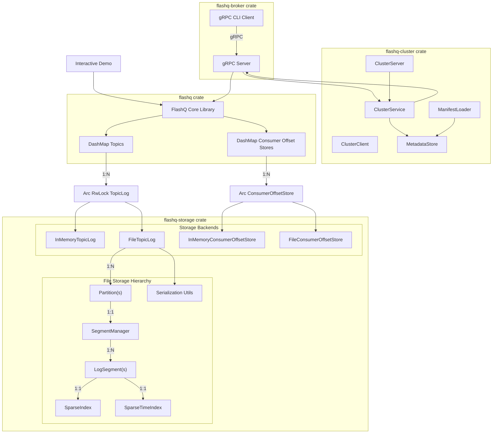
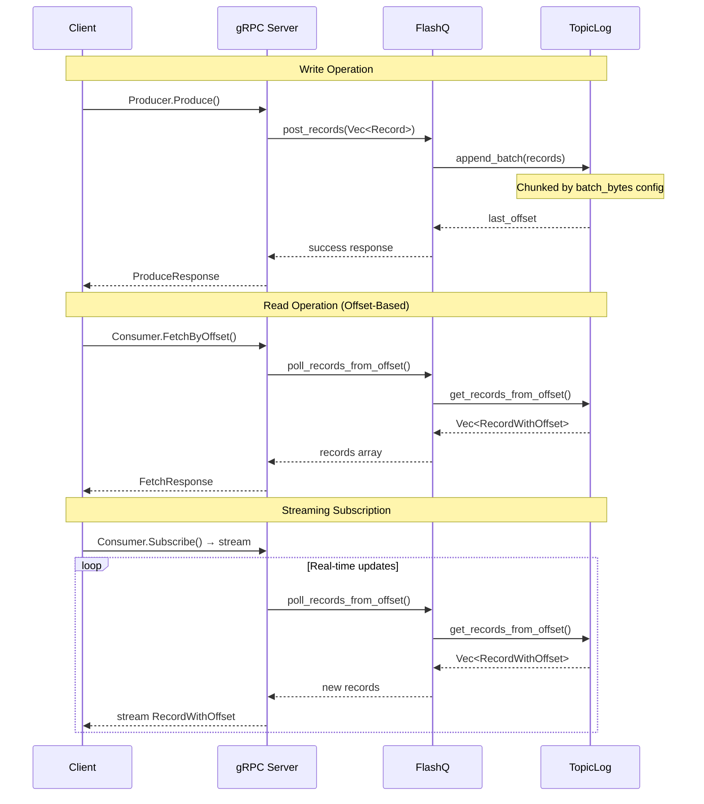

# Architecture

Internal architecture and design overview of FlashQ.

## System Overview



## Project Structure

**Storage Components (`flashq-storage` crate):**
- `Record/RecordWithOffset`: Message structures with keys, headers, and offsets
- `PartitionId`: Partition identification for topic organization
- `TopicLog/ConsumerOffsetStore` traits: Storage abstraction layer
- `StorageBackend`: Pluggable backends (memory/file) with batching
- `FileTopicLog`: File storage with partitions and segments
- `InMemoryTopicLog`: Fast in-memory storage

**Core Components (`flashq` crate):**
- `FlashQ`: Main queue with topic and consumer group management
- Re-exports storage types for backward compatibility

**Cluster Components (`flashq-cluster` crate):**
- `ClusterService`: Interface for cluster coordination operations
- `MetadataStore`: Persistent storage for broker and partition metadata
- `ClusterServer/ClusterClient`: gRPC adapters for cluster communication
- `ManifestLoader`: Bootstrap cluster state from configuration files

**gRPC Components (`flashq-grpc` crate):**
- `FlashQGrpcBroker`: Main server implementation
- Producer/Consumer/Admin services
- CLI client for testing and interaction

**Key Features:**
- Partition-aware storage infrastructure with per-partition offset tracking
- Snapshot-based consumer offset management with monotonic updates
- High-throughput batching with configurable batch sizes
- Thread-safe concurrent access with DashMap and RwLocks
- Kafka-style segment architecture with sparse indexing
- Cluster coordination with heartbeat protocol and leader election
- Crash recovery and directory locking for data safety
- FIFO ordering with non-destructive polling

## Data Flow



**Key Principles:**
- Sequential offsets with ISO 8601 timestamps
- Append-only logs ensure FIFO ordering  
- Non-destructive polling (records persist)
- Time-based and offset-based polling with sparse indexing
- Batched operations for high-throughput processing (4-44x performance improvement)
- Configurable batch_bytes for storage I/O optimization
- Concurrent access with DashMap and RwLock for improved performance
- Segment-based storage for scalability and Kafka alignment

## Segment-Based Storage

**File Storage Architecture:**
- **Segment Structure**: Kafka-aligned .log files with sequential naming (000000000000000000.log) and .timeindex files for time-based queries
- **Rolling Segments**: New segments created when configured thresholds are met
- **Sparse Index**: Efficient offset-to-file-position mapping within segments
- **Crash Recovery**: Rebuilds state by scanning existing segment files on startup
- **Directory Locking**: Process-level locks prevent concurrent access to storage directory

**Segment Format:**
```
[4-byte payload_size][8-byte offset][4-byte timestamp_len][timestamp][record_json]
```

**Directory Structure:**
```
data/
├── consumer_groups/               # Consumer group offset storage
│   ├── analytics-group.json       # Per-group offset persistence
│   └── realtime-processors.json   # Format: {"topic--partition": offset}
└── {topic}/
    └── {partition}/                   # Partition directory (0, 1, 2, ...)
        ├── 00000000000000000000.log       # First segment
        ├── 00000000000000000000.index     # Offset-to-position index
        ├── 00000000000000000000.timeindex # Timestamp-to-position index
        ├── 00000000000000000010.log       # Second segment (starting at offset 10)
        ├── 00000000000000000010.index     # Index for second segment
        ├── 00000000000000000010.timeindex # Time index for second segment
        └── ...
```

**Partition Organization:**
- Each topic contains multiple partitions (numbered 0, 1, 2, ...)
- Backward compatibility: operations default to partition 0 when no partition is specified
- Each partition maintains independent offset counters and segment files
- Partition directories are created dynamically as data is written

## Design Decisions

**Key Design Decisions:**
- **Partition organization**: Storage layer supports multiple partitions (currently defaults to partition 0)
- **Backward compatibility**: Existing APIs maintained while partition infrastructure is built
- **Batched operations**: Configurable batching for high-throughput performance
- **Storage abstraction**: Pluggable backends (memory/file) via traits
- **Kafka-aligned segments**: Rolling log files with sparse indexing
- **Append-only logs**: Immutable history with FIFO ordering

**Consumer Offset Management:**
- **ConsumerOffsetStore trait**: Snapshot-based offset storage with monotonic updates
- **Persistence**: File-based stores persist offsets to `data/consumer_groups/{group_id}.json`
- **Format**: `{"group_id": "...", "offsets": {"topic--partition": offset}}`
- **Monotonic enforcement**: `persist_snapshot` only updates if `new_offset >= current_offset`
- **Thread-safe**: Implementations use parking_lot RwLock for concurrent access
- **Backward compatibility**: Legacy ConsumerGroup trait still supported during transition

**Cluster Coordination:**
- **Metadata management**: Track brokers, topics, and partition assignments
- **Heartbeat protocol**: Bidirectional streaming for broker liveness and state sync
- **Epoch-based consistency**: Prevent split-brain scenarios during leadership changes
- **Manifest loading**: Initialize cluster state from YAML/JSON configuration
- **File-based persistence**: Cluster metadata stored in `metadata.json`

**Current Limitation**: Multiple partitions are implemented at the storage layer but not yet exposed through the public API. All operations currently use partition 0.

## Performance Characteristics

**Complexity:**
- Memory storage: O(n) total records, batched append O(b) for b records
- File storage: O(1) append, O(k) for k records read, batched append O(b) with single I/O
- Post: O(1) append operation, batched O(b) with chunked writes
- Poll: O(k) for k records with streaming reads
- Concurrency: DashMap provides lock-free access, RwLock enables concurrent reads

**Trade-offs:**
- **Batched vs Single**: 4-44x performance improvement vs operational complexity
- **Memory vs File**: Speed vs persistence (8-43x performance difference)
- **Batch size**: Higher throughput vs memory usage (configurable via batch_bytes)
- **Segment rolling**: Storage efficiency vs lookup complexity
- **Directory locking**: Safety vs multi-process access
- **Sparse indexing**: Memory efficiency vs lookup speed
- FIFO ordering vs parallelism

## Benchmarking Architecture

**Framework**: Divan with AllocProfiler for memory tracking
**Test Structure**: 1KB records with keys, headers, and payloads
- Empty topic tests: 500 record batches  
- Large dataset tests: 100 records with 2K record context
- Batching tests: 1K and 10K record batches with throughput measurement
- Memory profiling tracks allocations, deallocations, and peak usage

## Storage Backend Performance

Detailed performance benchmarks and capacity planning guidance are available in the [Performance Documentation](performance.md).