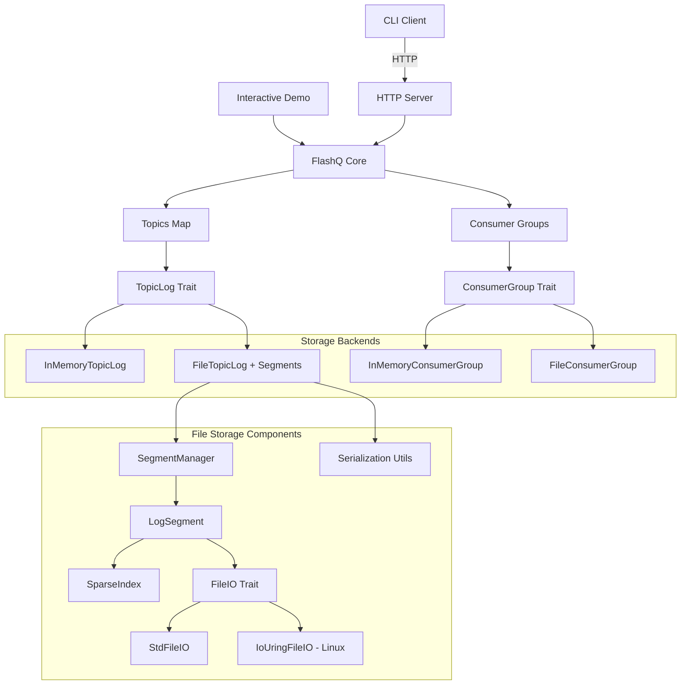
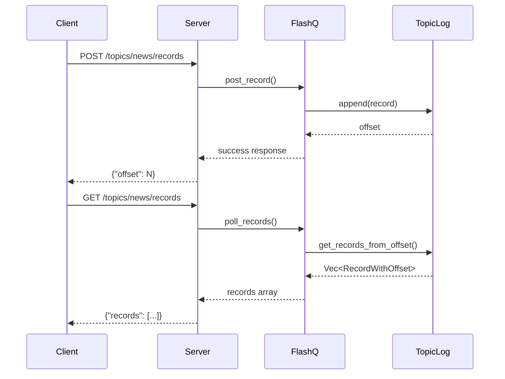

# Architecture

Internal architecture and design overview of FlashQ.

## System Overview



## Project Structure

**Core Components:**
- `FlashQ`: Topic-based record storage with pluggable backend support
- `Record/RecordWithOffset`: Record structures for requests/responses
- `TopicLog` trait: Storage abstraction for append-only topic logs
- `ConsumerGroup` trait: Storage abstraction for offset management
- `StorageBackend`: Factory with directory locking and backend selection
- `FileTopicLog`: Kafka-aligned segment-based file storage with crash recovery
- `SegmentManager`: Manages log segment lifecycle and rolling
- `LogSegment`: Individual segment files with sparse indexing and pluggable I/O
- `SparseIndex`: Efficient offset-to-position mapping within segments
- `FileIO` trait: Abstraction for file I/O operations (standard vs io_uring)
- `StdFileIO`: Standard file I/O implementation using std::fs
- `IoUringFileIO`: Linux io_uring implementation for high-performance I/O (experimental)
- `InMemoryTopicLog`: Fast in-memory storage implementation

**Key Features:**
- Thread-safe concurrent access with pluggable storage backends
- Kafka-aligned segment architecture with rolling and sparse indexing
- Pluggable I/O layer with standard and io_uring implementations
- Directory locking and crash recovery for data durability
- Append-only logs with FIFO ordering and non-destructive polling

## Data Flow



**Key Principles:**
- Sequential offsets with ISO 8601 timestamps
- Append-only logs ensure FIFO ordering  
- Non-destructive polling (records persist)
- Thread-safe with `Arc<Mutex<>>`
- Segment-based storage for scalability and Kafka alignment

## Segment-Based Storage

**File Storage Architecture:**
- **Segment Structure**: Kafka-aligned .log files with sequential naming (000000000000000000.log)
- **Rolling Segments**: New segments created when configured thresholds are met
- **Sparse Index**: Efficient offset-to-file-position mapping within segments
- **Crash Recovery**: Rebuilds state by scanning existing segment files on startup
- **Directory Locking**: Process-level locks prevent concurrent access to storage directory

**Segment Format:**
```
[4-byte payload_size][8-byte offset][4-byte timestamp_len][timestamp][record_json]
```

**Directory Structure:**
```
data/
└── {topic}/
    ├── 00000000000000000000.log  # First segment
    ├── 00000000000000000010.log  # Second segment (starting at offset 10)
    └── ...
```

## Design Decisions

**Architecture Choices:**
- **Storage abstraction**: Trait-based pluggable backends with memory and file implementations
- **I/O abstraction**: FileIO trait enables standard vs io_uring implementations
- **Segment-based storage**: Kafka-aligned architecture for scalability and industry compatibility
- **Directory locking**: Prevents data corruption from concurrent processes
- **Sparse indexing**: Efficient offset lookup without loading entire segments
- **Error handling**: Comprehensive error types with context preservation
- **Owned data**: Returns `Vec<RecordWithOffset>` vs references
- **Safe casting**: `try_into()` with bounds checking
- **Append-only logs**: Immutable history, FIFO ordering

## Performance Characteristics

**Complexity:**
- Memory storage: O(n) total records
- File storage: O(1) append, O(k) for k records read
- Post: O(1) append operation (with segment indexing)
- Poll: O(k) for k records
- Concurrency: Single lock bottleneck per storage backend

**Trade-offs:**
- **Memory vs File**: Speed vs persistence (13-680x performance difference)
- **Standard vs io_uring I/O**: Maturity vs experimental performance
- **Segment rolling**: Storage efficiency vs lookup complexity
- **Directory locking**: Safety vs multi-process access
- **Sparse indexing**: Memory efficiency vs lookup speed
- FIFO ordering vs parallelism

## Benchmarking Architecture

**Framework**: Divan with AllocProfiler for memory tracking
**Test Structure**: 1KB records with keys, headers, and payloads
- Empty topic tests: 500 record batches  
- Large dataset tests: 100 records with 2K record context
- Memory profiling tracks allocations, deallocations, and peak usage

## Storage Backend Performance

Detailed performance benchmarks and capacity planning guidance are available in the [Performance Documentation](performance.md).