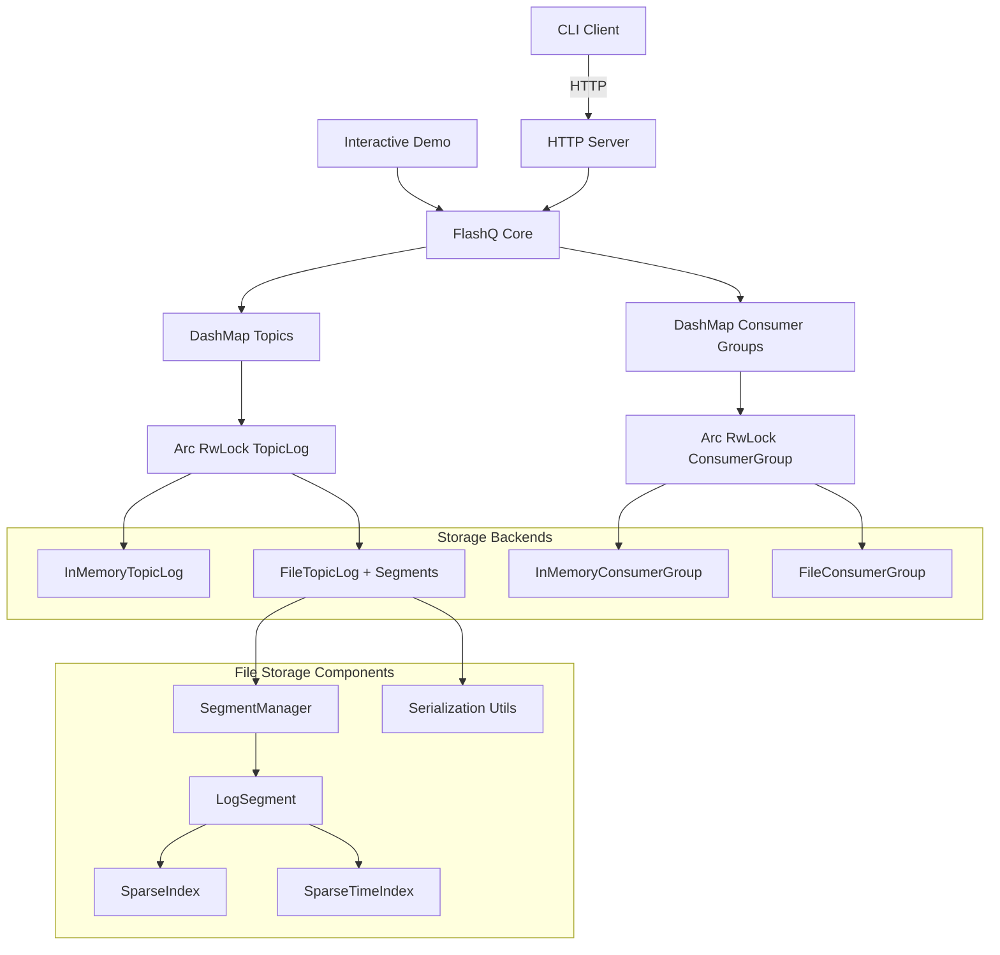
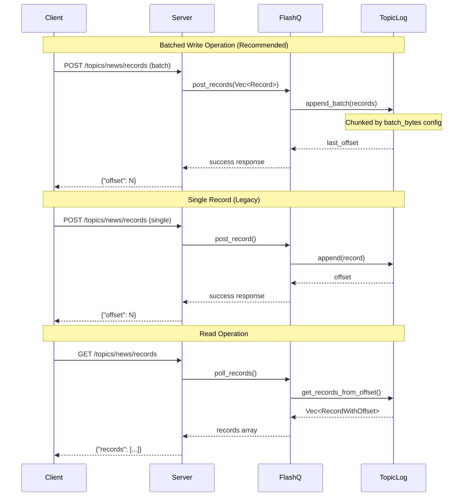

# Architecture

Internal architecture and design overview of FlashQ.

## System Overview



## Project Structure

**Core Components:**
- `FlashQ`: Topic-based record storage with pluggable backend support
- `Record/RecordWithOffset`: Record structures for requests/responses
- `TopicLog` trait: Storage abstraction with batched append operations (`append_batch`)
- `ConsumerGroup` trait: Storage abstraction for offset management
- `StorageBackend`: Factory with configurable batch_bytes and backend selection
- `batching_heuristics`: Shared utilities for record size estimation and batching logic
- `FileTopicLog`: Kafka-aligned segment-based file storage with batched writes
- `SegmentManager`: Manages log segment lifecycle and rolling with streaming reads
- `LogSegment`: Individual segment files with bulk append and sparse indexing
- `SparseIndex`: Efficient offset-to-position mapping within segments
- `SparseTimeIndex`: Efficient timestamp-to-position mapping for time-based queries
- `InMemoryTopicLog`: Fast in-memory storage with batched operations

**Key Features:**
- Batched operations with configurable batch_bytes for high-throughput processing
- Concurrent access with DashMap and reader-writer locks for improved performance
- Kafka-aligned segment architecture with rolling and sparse indexing
- Directory locking and crash recovery for data durability
- Append-only logs with FIFO ordering and non-destructive polling

## Data Flow



**Key Principles:**
- Sequential offsets with ISO 8601 timestamps
- Append-only logs ensure FIFO ordering  
- Non-destructive polling (records persist)
- Batched operations for high-throughput processing (4-44x performance improvement)
- Configurable batch_bytes for storage I/O optimization
- Concurrent access with DashMap and RwLock for improved performance
- Segment-based storage for scalability and Kafka alignment

## Segment-Based Storage

**File Storage Architecture:**
- **Segment Structure**: Kafka-aligned .log files with sequential naming (000000000000000000.log) and .timeindex files for time-based queries
- **Rolling Segments**: New segments created when configured thresholds are met
- **Sparse Index**: Efficient offset-to-file-position mapping within segments
- **Crash Recovery**: Rebuilds state by scanning existing segment files on startup
- **Directory Locking**: Process-level locks prevent concurrent access to storage directory

**Segment Format:**
```
[4-byte payload_size][8-byte offset][4-byte timestamp_len][timestamp][record_json]
```

**Directory Structure:**
```
data/
└── {topic}/
    ├── 00000000000000000000.log       # First segment
    ├── 00000000000000000000.index     # Offset-to-position index
    ├── 00000000000000000000.timeindex # Timestamp-to-position index
    ├── 00000000000000000010.log       # Second segment (starting at offset 10)
    ├── 00000000000000000010.index     # Index for second segment
    ├── 00000000000000000010.timeindex # Time index for second segment
    └── ...
```

## Design Decisions

**Architecture Choices:**
- **Batched operations**: `append_batch` trait method with configurable batch_bytes for performance
- **Storage abstraction**: Trait-based pluggable backends with memory and file implementations
- **Segment-based storage**: Kafka-aligned architecture with bulk writes for scalability
- **Directory locking**: Prevents data corruption from concurrent processes
- **Sparse indexing**: Efficient offset and timestamp lookup without loading entire segments
- **Error handling**: Comprehensive error types with context preservation
- **Owned data**: Returns `Vec<RecordWithOffset>` vs references
- **Safe casting**: `try_into()` with bounds checking
- **Append-only logs**: Immutable history, FIFO ordering

## Performance Characteristics

**Complexity:**
- Memory storage: O(n) total records, batched append O(b) for b records
- File storage: O(1) append, O(k) for k records read, batched append O(b) with single I/O
- Post: O(1) append operation, batched O(b) with chunked writes
- Poll: O(k) for k records with streaming reads
- Concurrency: DashMap provides lock-free access, RwLock enables concurrent reads

**Trade-offs:**
- **Batched vs Single**: 4-44x performance improvement vs operational complexity
- **Memory vs File**: Speed vs persistence (8-43x performance difference)
- **Batch size**: Higher throughput vs memory usage (configurable via batch_bytes)
- **Segment rolling**: Storage efficiency vs lookup complexity
- **Directory locking**: Safety vs multi-process access
- **Sparse indexing**: Memory efficiency vs lookup speed
- FIFO ordering vs parallelism

## Benchmarking Architecture

**Framework**: Divan with AllocProfiler for memory tracking
**Test Structure**: 1KB records with keys, headers, and payloads
- Empty topic tests: 500 record batches  
- Large dataset tests: 100 records with 2K record context
- Batching tests: 1K and 10K record batches with throughput measurement
- Memory profiling tracks allocations, deallocations, and peak usage

## Storage Backend Performance

Detailed performance benchmarks and capacity planning guidance are available in the [Performance Documentation](performance.md).